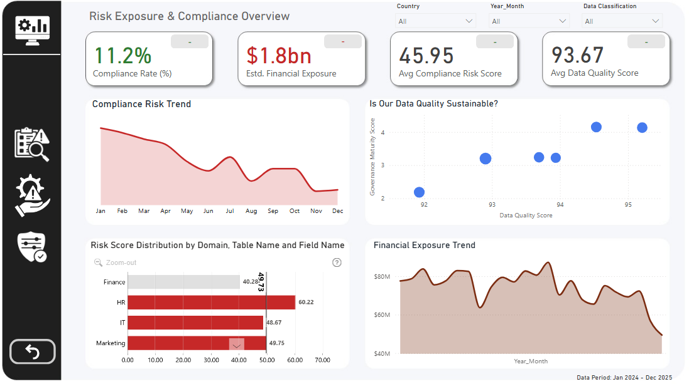
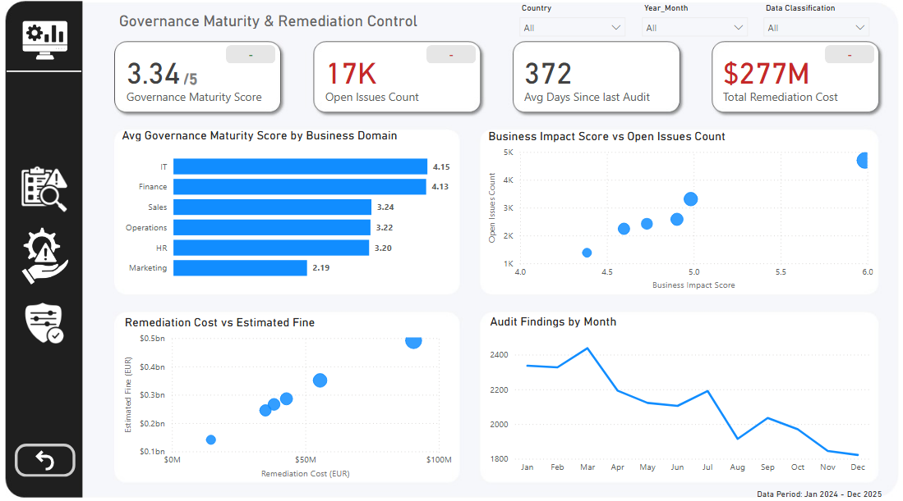

# Enterprise Data Governance & Compliance Dashboard

## Overview
This Power BI dashboard tracks enterprise data governance, compliance monitoring, and risk management across the organization. Providing insights into compliance rates, risk exposure, governance maturity, and remediation efforts.

## Dashboard Pages

### Risk Exposure & Compliance Overview

### Risk Drivers & Compliance Breakdown

### Governance Maturity & Remediation Control

## Key Metrics Tracked

- Compliance rates and risk scores
- Financial exposure and estimated fines
- Data quality scores
- Governance maturity levels
- Open issues and remediation costs
- Audit findings and trends

## Key Insights

- Current compliance rate stands at 11.2% with €1.8 billion in estimated financial exposure.
- HR and IT departments show the highest risk scores.
- Sensitive data carries significantly higher compliance risk compared to other classifications.
- 31% non-compliance rate across the organization with 3 high-risk domains identified.
- Total remediation cost of €277M with 17K open issues.
